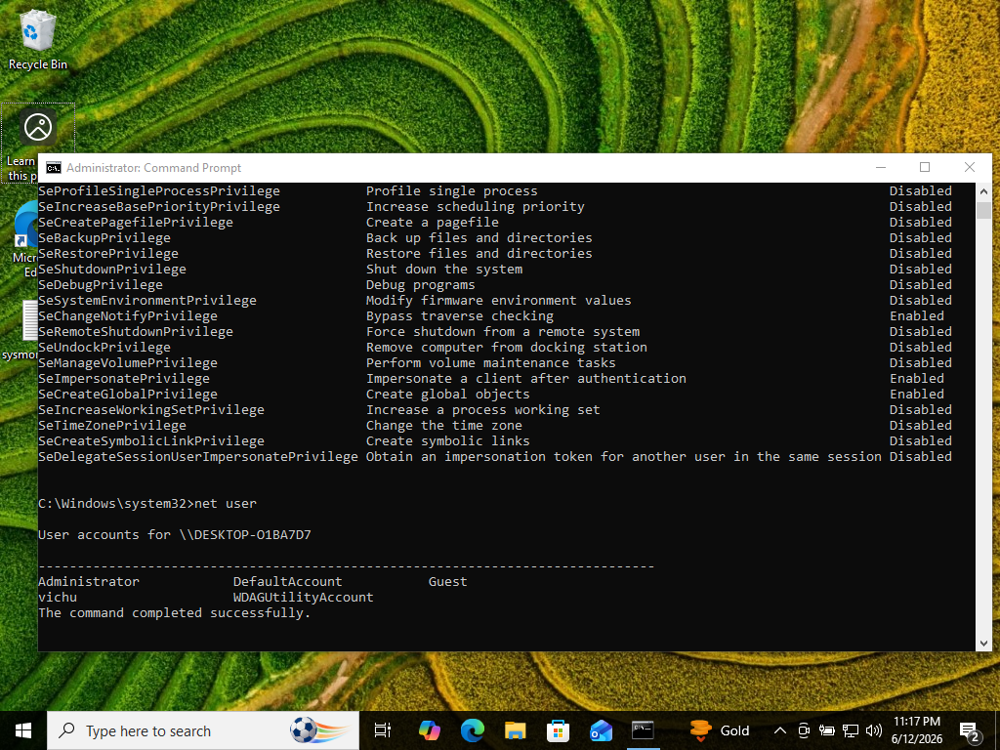
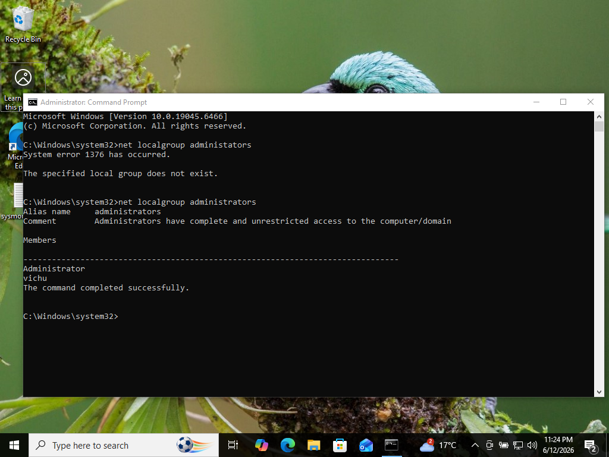
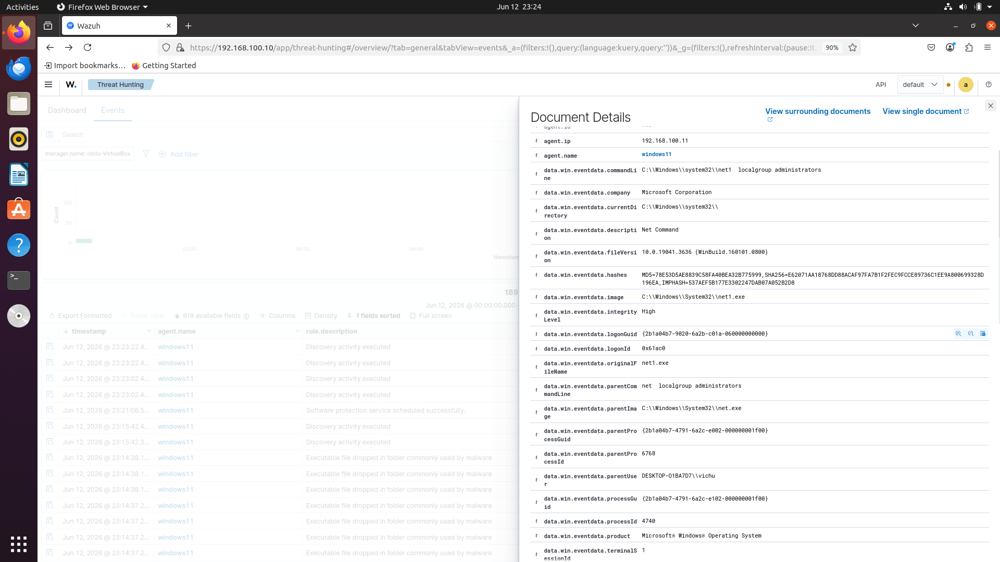
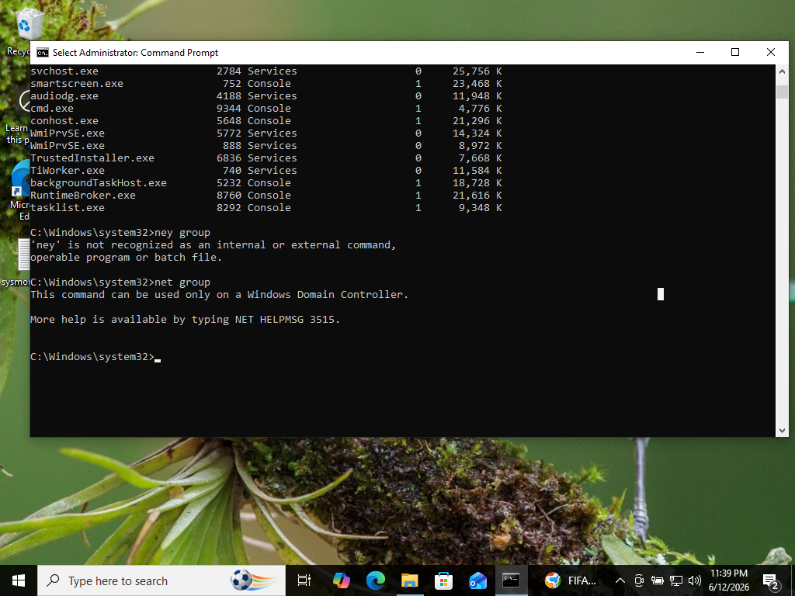
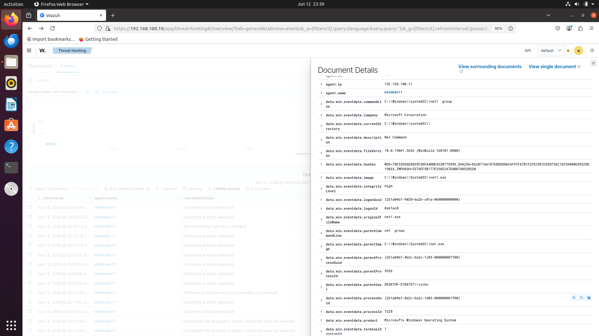
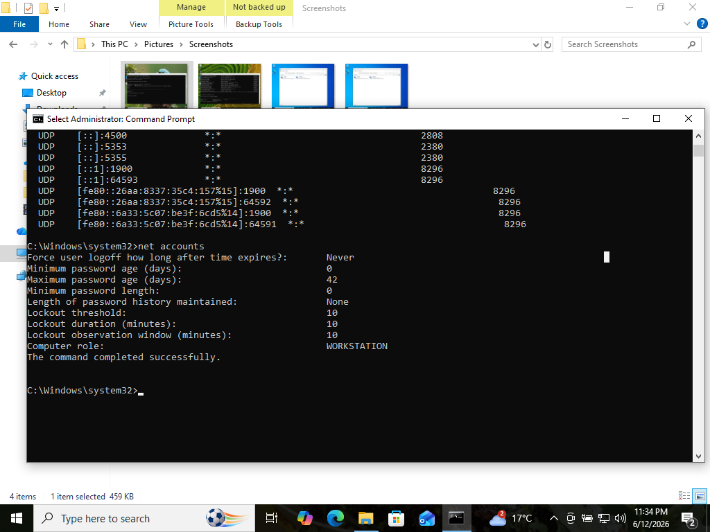
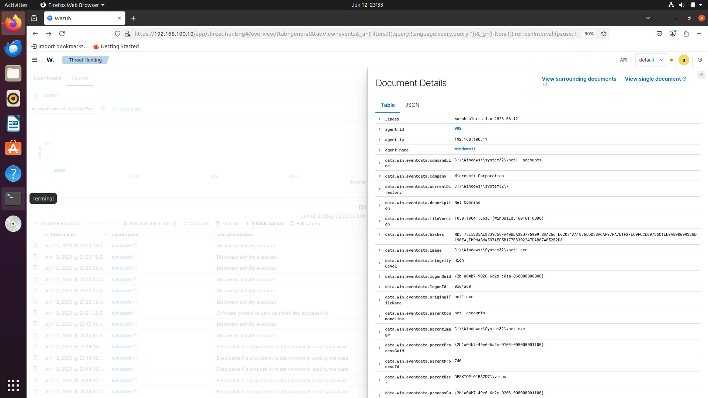

# Windows Reconnaissance Detection using Sysmon and Wazuh

## Introduction

This project demonstrates the detection of Windows reconnaissance activity using Sysmon and Wazuh in a SOC homelab environment.

## Background

Attackers often enumerate users, groups, and account policies after obtaining initial access to a system.

## Learning Objectives

- Understand reconnaissance techniques
- Analyze Sysmon process creation events
- Investigate Wazuh alerts
- Map detections to MITRE ATT&CK

## Activities and Tasks

The following commands were executed:

```cmd
net user
net localgroup administrators
net group
net accounts
```

## Detection Results

The commands generated Wazuh alerts related to account and group enumeration activities.

## MITRE ATT&CK Mapping

| Command | Technique |
|----------|-----------|
| net user | T1087 Account Discovery |
| net localgroup administrators | T1069 Permission Groups Discovery |
| net group | T1069 Permission Groups Discovery |
| net accounts | T1087 Account Discovery |

## Skills and Competencies

- Wazuh SIEM
- Sysmon
- Threat Hunting
- Windows Event Analysis
- MITRE ATT&CK Mapping
- Security Monitoring

## Challenges and Solutions

Some reconnaissance commands generated alerts while others only generated telemetry. This helped demonstrate the difference between event collection and detection logic.

## Outcomes and Impact

The detection pipeline from Windows endpoint → Sysmon → Wazuh was successfully validated.

## Conclusion

This project successfully demonstrated the detection and investigation of Windows reconnaissance activities using Sysmon and Wazuh.

## Evidence

### net user Command



### net user Alert


### net localgroup administrators Command



### net localgroup administrators Alert



### net group Command



### net group Alert



### net accounts Command



### net accounts Alert



